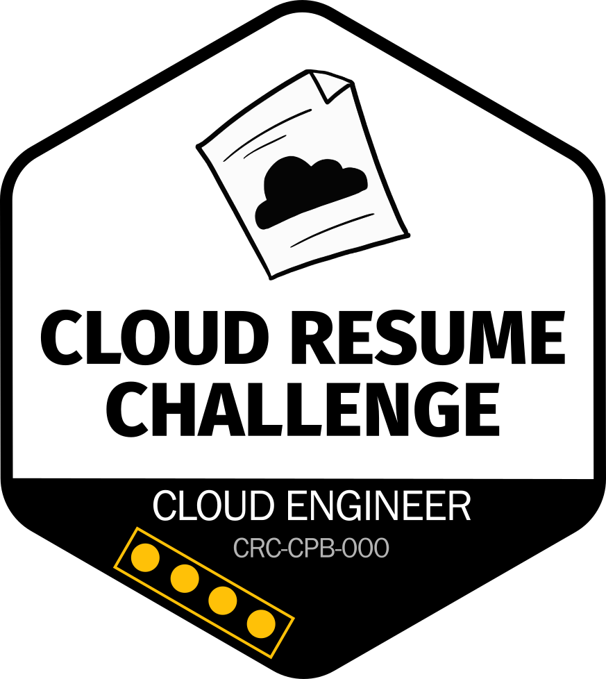

# Cloud Resume Challenge

Multi-cloud serverless resume website built for the [Cloud Resume Challenge](https://cloudresumechallenge.dev/) via the [ExamPro bootcamp](https://www.exampro.co/crc-cpb-000).

## Recognition

Awarded the inaugural **Admiral** badge upon completion - a special honorary rank issued to bootcampers who exceed Captain-level achievement. Admirals operate beyond the standard progression track and help lead the community forward.

## Live Site

**[danphillips.cloud](https://danphillips.cloud)** (AWS)

## Architecture

The resume site was deployed on two cloud platforms to demonstrate multi-cloud expertise:

- **AWS**: CloudFormation, S3, CloudFront, Lambda, DynamoDB, Route 53
- **GCP**: Terraform, GCS, Cloud Functions, Firestore, Cloudflare

Both use Ansible for deployment automation and share the same frontend/backend code.

## Documentation

- [Frontend](./frontend/README.md) - Static HTML/CSS/JS resume with visitor counter
- [Backend](./backend/README.md) - Python build scripts and mock API for local development
- [AWS](./aws/README.md) - CloudFormation infrastructure and deployment
- [GCP](./gcp/README.md) - Terraform infrastructure and deployment