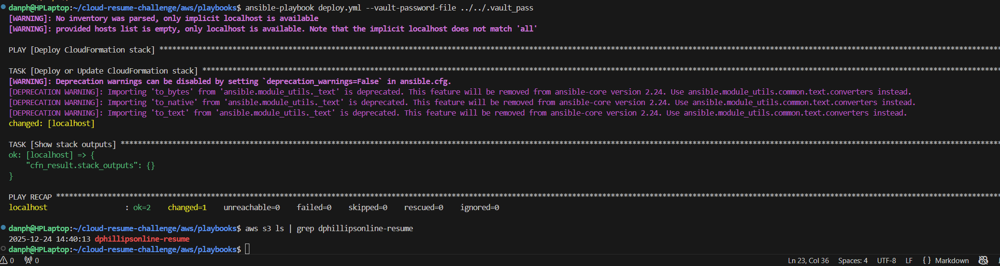

# AWS Infrastructure

CloudFormation-based serverless infrastructure with Ansible deployment automation.

## Overview

The AWS infrastructure uses CloudFormation for resource management and Ansible for deployment automation. The architecture is serverless and VPC-free to keep costs within free tier limits while serving the static website and visitor counter API.

## Features

- **CloudFormation Infrastructure**: AWS-native IaC for all resources
- **Ansible Deployment**: Automated stack deployment and content uploads
- **Serverless Architecture**: Lambda, API Gateway, DynamoDB—no VPC costs
- **CloudFront + S3**: Global CDN with private buckets and OAC security
- **Encrypted Credentials**: Ansible Vault for secure credential management
- **Cache Invalidation**: Automated CloudFront cache clearing on deploy
- **Dual Distribution**: WWW primary with apex redirect pattern

## Architecture

```
Route 53 (danphillipsonline.com)
    ↓
CloudFront (ACM certificate for HTTPS)
    ↓
S3 Bucket (static website files)

CloudFront also connects to:
    ↓
API Gateway (/api/counter)
    ↓
Lambda (visitor counter logic, NO VPC)
    ↓
DynamoDB (visitor count storage)
```

**Key Design Choices:**
- **No VPC**: Lambda runs in AWS-managed environment (free tier eligible)
- **CloudFront + OAC**: Private S3 buckets with secure CloudFront access
- **Serverless**: Pay only for what you use (essentially free for this traffic)

## Quick Start

### Prerequisites

Install Ansible and AWS dependencies:

```bash
pipx install --include-deps ansible
pipx inject ansible boto3 botocore
ansible-galaxy collection install amazon.aws
```

### Configure Credentials

Create an encrypted vault for AWS credentials:

```bash
ansible-vault create vaults/prod.yml
```

Add the following to the vault:
```yaml
AWS_REGION: us-east-1
AWS_ACCESS_KEY_ID: your-key-id
AWS_SECRET_ACCESS_KEY: your-secret-key
STACK_NAME: your-cloudformation-stack-name
```

**Security Note:** Store the vault password in `.vault_pass` (gitignored). Never commit credentials to version control.

## Directory Structure

```text
aws/
├── README.md                   # This file
├── frontend.yaml               # CloudFormation template for frontend
├── backend-counter.yaml        # CloudFormation template for counter API
├── playbooks/
│   ├── deploy-aws.yml         # Deploy CloudFormation stack
│   └── upload-aws.yml         # Upload files + invalidate cache
└── images/                     # Architecture diagrams
```

## Deployment

### Deploy Infrastructure

Deploy or update the CloudFormation stack:

```bash
cd aws/playbooks
ansible-playbook deploy-aws.yml --vault-password-file ../../.vault_pass
```

This creates:
- S3 buckets (www + apex redirect)
- CloudFront distributions (2 total)
- Origin Access Control (OAC)
- Bucket policies and stack outputs



### Upload Website Files

After infrastructure is ready, deploy the static site:

```bash
ansible-playbook upload-aws.yml --vault-password-file ../../.vault_pass
```

This will:
1. Validate `frontend/public/` directory exists
2. Sync files to `www.danphillipsonline.com` S3 bucket
3. Delete files from S3 that don't exist locally (clean deploys)
4. Invalidate CloudFront cache (`/*` all files)
5. New content live in ~30-60 seconds


## Configuration

### Domain Setup

- **Primary URL**: `https://www.danphillipsonline.com` (main site)
- **Apex Redirect**: `https://danphillipsonline.com` → redirects to www
- **SSL Certificate**: Wildcard ACM cert (`*.danphillipsonline.com`)

### CloudFront Distributions

Two distributions handle different purposes:

1. **WWW Distribution** (ID: `E3J4QYS4EHJHOH`)
   - Serves content from `www.danphillipsonline.com` bucket
   - Private bucket with OAC (Origin Access Control)
   - Cache invalidation on every deploy

2. **Apex Distribution** (ID: `EEN5OIGV5JHHT`)
   - Handles redirect from apex → www
   - Sources from `danphillipsonline.com` bucket (S3 website redirect)

### S3 Bucket Strategy

- **www.danphillipsonline.com**: Private bucket with all static files
- **danphillipsonline.com**: Public redirect bucket (301 to www)

The redirect bucket uses S3 website hosting configuration and requires no file uploads.

---

## Development Journey

This section documents the design decisions and approach for building the AWS infrastructure. I'm sure I'll make adjustments as I learn more about CloudFormation and AWS best practices, but this is how it all started.

### CloudFormation vs Terraform

For this challenge, I chose CloudFormation for AWS infrastructure. While I could use Terraform for everything, I wanted to explore AWS-native tooling since CloudFormation integrates directly with AWS services. I'll switch to Terraform for the GCP implementation to compare both approaches hands-on.

### Serverless and Free Tier Optimization

I designed this architecture to stay within AWS free tier limits. Running Lambda without a VPC keeps costs at zero for this traffic level. CloudFront, S3, and DynamoDB are all free tier eligible, and the serverless model means I only pay for actual usage—which is essentially nothing for a personal resume site.

### WWW as Primary Domain

I initially set up the apex domain (`danphillipsonline.com`) as primary with www redirecting to it. After deploying, I reversed this decision:

- **Clear bucket identification**: `www.danphillipsonline.com` bucket = website files, `danphillipsonline.com` bucket = redirect only
- **Future subdomain flexibility**: Keeps apex free for `api.danphillipsonline.com`, `blog.danphillipsonline.com`, etc.
- **Operational clarity**: When debugging, it's immediately clear which bucket holds actual content

The redirect bucket never needs files uploaded—it's purely for S3 website redirect configuration.

### Ansible for Deployment Automation

I chose Ansible over AWS CLI scripts for deployment automation. Ansible playbooks are declarative, idempotent, and easier to read than bash scripts with chained AWS commands. The vault system handles credentials securely without environment variables or hardcoded values.

### Origin Access Control (OAC)

I used Origin Access Control instead of the older Origin Access Identity (OAI). OAC is AWS's modern recommendation with better security. It keeps S3 buckets completely private while allowing CloudFront to serve content.

### Lessons Learned

**Git Security**: I had to remove vault files from git history after initial commits. Lesson learned: always verify `.gitignore` before the first commit.

**CloudFormation Parameter Changes**: Changing parameter names (e.g., `BucketName` → `DomainName`) requires stack recreation, not just update. Parameter changes break CloudFormation's update mechanism.

**Cache Invalidation**: Critical to invalidate CloudFront cache after uploads. Without this, users see stale content for hours. The upload playbook automates this with every deployment.

**Distribution ID Tracking**: With multiple CloudFront distributions, tracking which ID corresponds to which purpose (www vs apex) matters for troubleshooting and automation.

---

## Troubleshooting

**Stack stuck in UPDATE_ROLLBACK_COMPLETE?**

```bash
# Check status
aws cloudformation describe-stacks --stack-name your-stack-name --region us-east-1

# Delete and redeploy if needed
aws cloudformation delete-stack --stack-name your-stack-name --region us-east-1
```

**Vault password lost?**

Recreate the vault file with new credentials:

```bash
ansible-vault create vaults/prod.yml
echo "your-new-password" > .vault_pass
chmod 600 .vault_pass
```
