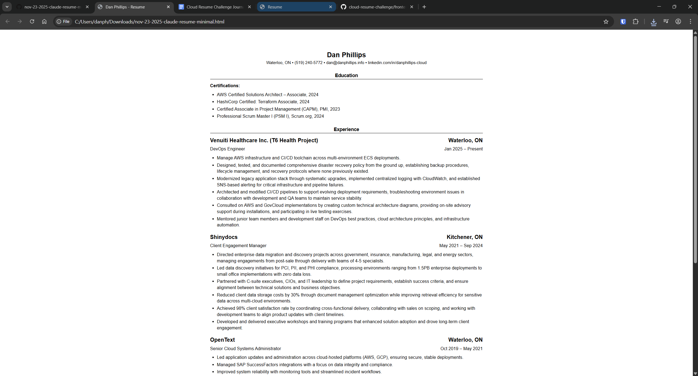
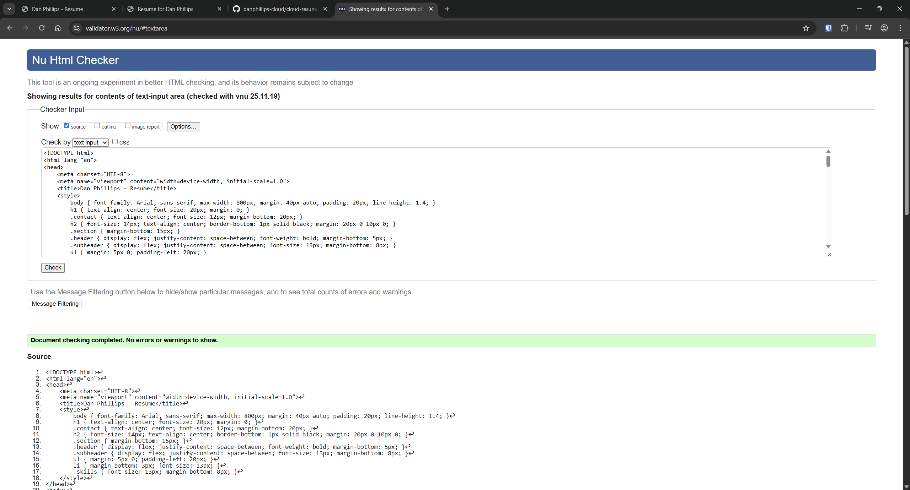
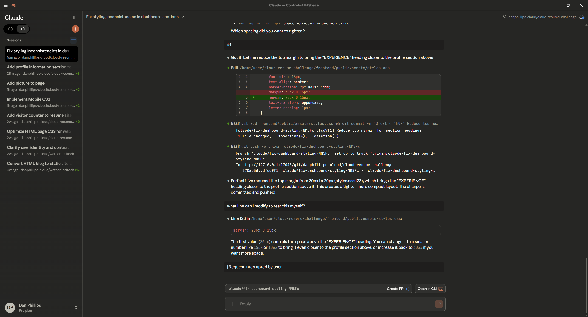
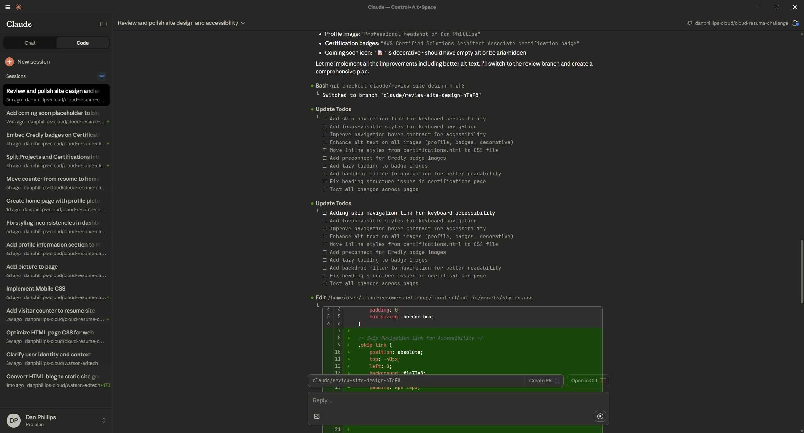
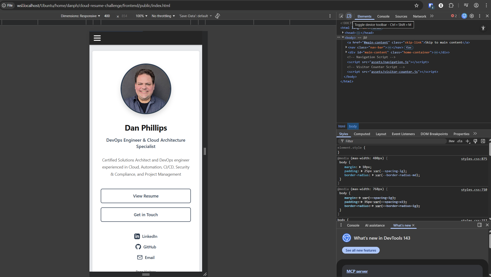

# Frontend

Static website serving an HTML resume with dynamic visitor counter and project showcase.

## Overview

The frontend is a lightweight, framework-free static website built with vanilla HTML, CSS, and JavaScript. It uses the Harvard Resume Template format with responsive design and server-side rendering for the projects page via Python/Markdown build scripts.

## Features

- **Static HTML Resume**: Clean, accessible resume using Harvard template format
- **Responsive Design**: Mobile-friendly with viewport optimization
- **Visitor Counter**: Dynamic counter with AWS Lambda/DynamoDB integration
- **Projects Page**: Server-side rendered from Markdown files (see `backend/`)
- **No Framework Dependencies**: Pure HTML/CSS/JS for simplicity and maintainability
- **W3C Validated**: Standards-compliant markup
- **Accessibility**: Optimized for screen readers and visual accessibility

## Quick Start

For backend setup (build scripts, mock API, dependencies), see [`backend/README.md`](../backend/README.md).

## Directory Structure

```text
frontend/
├── README.md                    # This file
└── public/
    ├── index.html              # Main resume page
    ├── projects.html           # Generated projects page (DO NOT EDIT)
    └── assets/
        ├── styles.css          # Main stylesheet
        ├── visitor-counter.js  # Counter logic
        └── images/             # Site images
```

## Configuration

### Visitor Counter

Edit `frontend/public/assets/visitor-counter.js` to configure the backend:

```javascript
const config = {
   awsEndpoint: 'https://your-api-gateway-url/api/visitor-count',
   activeBackend: 'aws'  // or 'mock' for local testing
};
```

For local testing with the mock API, see [`backend/README.md`](../backend/README.md#mock-counter-api).

---

## Development Journey

This section documents the development process and design decisions made while building the frontend. I'm sure I'll have to make slight changes as I progress, but this is how it all started.

### Resume Format Considerations

I'm using the [Harvard Resume Template format](https://careerservices.fas.harvard.edu/channels/create-a-resume-cv-or-cover-letter/#uc_resource_titles-4) as the basis for my resume.

### Harvard Resume Format Generation

I learned HTML by coding in Notepad back when GeoCities existed, but stopped once WYSIWYG editors became a thing. I'll use GenAI tools to generate the HTML and CSS. Once that is in place, I can adjust the code as needed for the project. Since I have a Pro account, I'll be using Claude Sonnet 4.5 to construct the HTML and add in content from my existing resume.

I started by giving Claude this Harvard Resume template image and asking it to convert it to HTML:

Prompt to Claude

```text
Convert this resume format into html.
Please don't use a css framework.
Please use the least amount of css tags
```


Claude generated clean HTML from the template image. Here's the [generated output](./docs/nov-23-2025-resume-minimal.html):


Then I uploaded my current resume and had Claude populate the template with my information:



I find that reminding AI, or repeating your prompts, improves your results. Just as if you were talking to a person and giving them clear instruction for a task.

### HTML Adjustments

- UTF8 will support most languages. I plan to use only English but will keep the meta tag in.
- To ensure the is the site is viewable on mobile devices, we'll include the viewport meta tag width=device-width
- I will simplify the HTML markup css selector to be as minimal as possible
- I will use the [W3c Validation Service](https://validator.w3.org/) to lint the code.



No errors. Score one for GenAI.

The code is also very easy to read and I feel that I could edit by hand without breaking a table or CSS.

### Serving Static Website Locally

I need to serve my static website locally so I can work with external stylesheets in a DEV environment. I'm using the [Live Server Extension for VSCode](https://marketplace.visualstudio.com/items?itemName=ritwickdey.LiveServer) for this. You can install this in CodeSpaces, but that has other limitations and local dev "just works".

CSS is not my strong suit. I do not have an eye for design, though I know what looks good. That is where Claude Code comes in to handle the heavy lifting while I fine tune. Here is an example PR that Claude Code generates:


### Frontend Approach Considerations

I initially tried using React and Vite for the frontend, but found myself spending more time troubleshooting setup than actually building. Since I plan to update the site regularly, keeping things simple made more sense. Something I can maintain and update without friction.

### Working with Claude Code

My Project Management background pays dividends when working with GenAI to generate HTML and CSS. It's powerful having a tool that can take detailed requirements, execute them, and create a PR ready for review and adjustments.

As you can see, I'm using separate chat sessions for each PR. I'm a big believer in "1 issue, 1 PR"—it keeps issue tracking clean. Claude even auto-generates issue descriptions in each PR.



That said, AI doesn't "see" the way humans do. Simple tasks like describing how I wanted padding to appear proved surprisingly difficult. Even with screenshots, Claude struggled to grasp what I wanted. Detailed written descriptions worked better, though I'm skeptical this approach would scale to more complex designs. The upside? The more I worked with it, the better I got at giving clear instructions.

Prompt to Claude

```text
Please look at the site in main branch and tell me if we need to clean anything up.
Let's make sure we have responsive design, mobile friendly, and easy on the eyes.
Fonts are clear and easy to read.
The page is also accessible for those with visual issues.
```



After all these branches and changes, I did my own code review and found things were messy. I went back to Claude to address issues like:

- Eliminating inline styles and improving structure
- Consistent naming and formatting
- Clear comments and documentation
- CSS variables and DRY principles

There's still some navigation/SVG duplication and other optimizations to tackle, but I'll leverage AWS/GCP tooling for that.

## Mobile Design Testing

Even if you tell your AI Agent to make something compatible with mobile, always check for yourself. I found an issue where the nav bar was cutting off my profile picture on every page which was easy to fix. This can easily be tested using your browser's dev tools where you can toggle different views for mobile. Here, I've added hamburger menu for navigation. 

